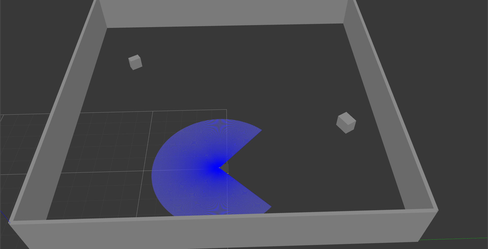

# gym-ropod

Defines a Gazebo-based OpenAI gym environment for a ROPOD robot.

## README contents

1. [Defined environments](#Defined-environments)
2. [Gazebo entities](#Gazebo-entities)
    1. [Gazebo worlds](#Gazebo-worlds)
        * [Square world](#Square-world)
    2. [Object models](#Object-models)
3. [Setup](#Setup)
4. [Usage](#Usage)
5. [Requirements](#Requirements)
6. [Acknowledgments](#Acknowledgments)

## Defined environments

### `ropod-nav-discrete-v0`

A navigation environment for a ropod with a discrete action space. In each episode, the robot's objective is to reach a randomly generated navigation goal without colliding with obstacles (a collision ends the episode).

The action space contains the following actions:
* `0`: forward motion with `0.1m/s`
* `1`: left motion with `0.1m/s`
* `2`: right motion with `0.1m/s`
* `3`: left turn with `0.1m/s` linear speed and `0.1m/s` rotational speed
* `4`: right turn with `0.1m/s` linear speed and `0.1m/s` rotational speed
* `5`: backward motion with `-0.1m/s`

The observation at each step is a list of 500 laser measurements obtained from a front laser scanner.

The reward is calculated using the following equation:


Here, `d` is the distance from the robot to the goal, `c_t` indicates whether the robot has collided at time `t`, and `a_t` denotes the action taken at time `t`. We thus want the robot to reach the goal without making unnecessary direction changes and without collisions. The values of the constants `c_1` and `c_2` are set to `-1000` and `-10` respectively.

## Gazebo entities

### Gazebo worlds

Gazebo worlds are included under [`model_config/worlds`](model_config/worlds). The world to be used in a simulation is specified when creating the environment and its elements are loaded on the fly. The currently defined worlds are briefly described below.

#### Square world

A simple square world without any static obstacles (other than the walls); any other obstacles are added on the fly at randomised positions. The world with the robot and two randomly added obstacles is shown below.



### Object models

Object models used in the simulation are included under [`model_config/models`](model_config/models) (the robot model is however not in this repository, but in [`ropod_sim_model`](https://github.com/ropod-project/ropod_sim_model)). These models are used for adding environment obstacles on the fly.

## Setup

1. Set up the package:
```
(sudo) python setup.py [develop|install]
```
2. Set the `ROPOD_GYM_MODEL_PATH` environment variable to the absolute path of the `model_config` directory:
```
export ROPOD_GYM_MODEL_PATH=/path/to/gym-ropod/model_config
```

## Usage

A simple usage example for the environment is given below. In this case, we load the square world and add five obstacles to it.

```
import gym
launch_file = '/path/to/my_simulation_launch_file.launch'

# create, render, and reset the environment
env = gym.make('ropod-nav-discrete-v0',
               launch_file_path=launch_file,
               env_type='square',
               number_of_obstacles=5)
env.render(mode='human')
env.reset()

# sample an action
action = env.action_space.sample()

# apply the sampled action and get information about the outcome
(goal, obs, reward, done) = env.step(action)
```

Test scripts that illustrate the environment use and should run out of the box can be found under [test](test).

## Requirements

* Python 3.5+
* `gym`
* `numpy`
* `transforms3d`
* `shapely`
* The [`ropod simulation`](https://github.com/ropod-project/ropod_sim_model)
* `rospkg`
* `termcolor`

## Acknowledgments

The implementation is heavily based on [this Toyota HSR gym environment](https://github.com/ascane/gym-gazebo-hsr)
